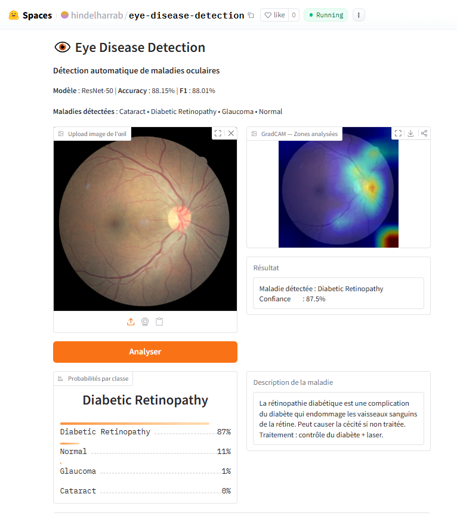

# Eye Disease Classification — Deep Learning
Eye Disease Classification using ResNet-50 &amp; EfficientNet-B4

## Demo en ligne
**[Tester l'application](https://huggingface.co/spaces/hindelharrab/eye-disease-detection)**

---

## Description

Projet de Deep Learning pour la **détection automatique
de maladies oculaires** à partir d'images de fond d'œil.

Deux architectures CNN ont été comparées :
- **ResNet-50** ← modèle final choisi
- **EfficientNet-B4**

---

## Classes détectées

| Classe | Description |
|--------|-------------|
| Normal | Œil sain |
| Cataract | Opacification du cristallin |
| Glaucoma | Endommagement du nerf optique |
| Diabetic Retinopathy | Complication du diabète |

---

## Dataset

- **Source** : [Eye Diseases Classification — Kaggle](https://www.kaggle.com/datasets/gunavenkatdoddi/eye-diseases-classification)
- **Total** : ~4217 images
- **Classes** : 4
- **Déséquilibre** : 1.09× (quasi équilibré)
